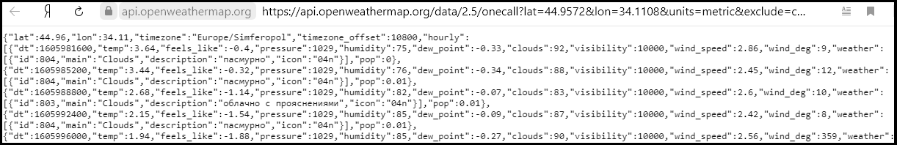
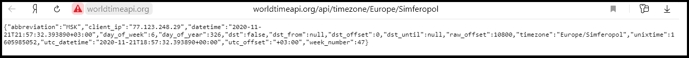
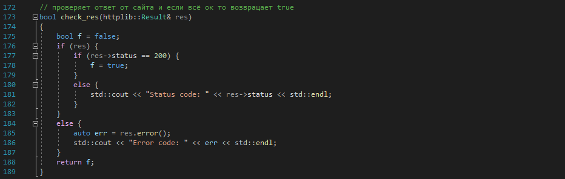

МИНИСТЕРСТВО НАУКИ  И ВЫСШЕГО ОБРАЗОВАНИЯ РОССИЙСКОЙ ФЕДЕРАЦИИ

Федеральное государственное автономное образовательное учреждение высшего образования

"КРЫМСКИЙ ФЕДЕРАЛЬНЫЙ УНИВЕРСИТЕТ им. В. И. ВЕРНАДСКОГО"

ФИЗИКО-ТЕХНИЧЕСКИЙ ИНСТИТУТ

Кафедра компьютерной инженерии и моделирования

 

<h3 align="center">Отчёт по лабораторной работе № 1  по дисциплине "Программирование"</h3>

  

студента 1 курса группы ПИ-б-о-201(1) 

Баламутин Егор Никитович 

направления подготовки 09.03.04 "Программная инженерия"

  

<table>

<tr><td>Научный руководитель  старший преподаватель кафедры  компьютерной инженерии и моделирования</td>

<td>(оценка)</td>

<td>Чабанов В.В.</td>

</tr>

</table>

  

Симферополь, 2020

## Постановка задачи

Разработать сервис предоставляющий данные о погоде в городе Симферополе на момент запроса.
  В качестве источника данных о погоде использовать: http://openweathermap.org/. 
В состав сервиса входит: серверное приложение на языке С++ и клиентское приложение на языке Python.

Серверное приложение (далее Сервер) предназначенное для обслуживания клиентских приложений и
 минимизации количества запросов к сервису openweathermap.org. Сервер должен обеспечивать 
возможность получения данных в формате JSON и виде html виджета (для вставки виджета на страницу будет 
использоваться iframe).

Клиентское приложение должно иметь графический интерфейс отображающий сведения о погоде и 
возможность обновления данных по требованию пользователя.

## Выполнение работы

#### Работа с сервисом openweathermap.org

Вначале я зарегестрировался на сервисе openweathermap.org и в разделе API key получил свой ключ API:`"bad75ef80333e8205e98138e6836321a"`

Рис 1. Получение ключа API

Затем на странице  http://openweathermap.org/appid#use сервиса я изучил инструкции по работе 
с ключом API и созданию http-запросов. 
После этого я смог составить следующий запрос:

`"http://api.openweathermap.org/data/2.5/onecall?lat=44.9572&lon=34.1108&units=metric&exclude=current,minutely,daily,alerts&lang=ru&appid=bad75ef80333e8205e98138e6836321a"`

где:
* `lat` - широта
* `lon` - долгота
* `lang` - язык
* `units` - система мер
* `exclude` - поля, которые нужно исключить из ответа

При вводе этого запроса сервис генерирует ответ в формате json:

Рис 2. Ответ сервиса openweather в формате json

Я изучил его структуру с помощью сервиса  JSON Viewer.
 Он содержит следующие поля: lat, lon, timezone, timezone_offset и массив hourly
 на 48 эллементов содержащий почасовой прогноз погоды на 48 часов. В элементах этого массива 
и содержится нужная информация. А именно в полях:

* `hourly[i]["dt"]` - значение времени, на которое был сделан прогноз
* `hourly[i]["temp"]` - значение температуры
* `hourly[i]["weather"][0]["description"]` - описание погоды
* `hourly[i]["weather"][0]["icon"]` - номер иконки (для виджета)

#### Работа с сервисом worldtimeapi.org

Также для работы будующего приложения требуется знать текущее время. Для этого нужно воспользоватся 
сервисом worldtimeapi.org, который позваляет получить время в формате json. 
При вводе запроса `"http://worldtimeapi.org/api/timezone/Europe/Simferopol"` сервис генерирует ответ в формате json:

Рис 3. Ответ сервиса worldtimeapi.org в формате json

Нужное значение времени находится в поле `["unixtime"]`. По нему будующая программа будет искать 
подходящий элемент в массиве hourly.

#### Серверное приложение

Серверное приложение написанно на языке C++. Оно принимает запрос, запрашивает данные с сервисов openweathermap.org и worldtimeapi.org 
и отправляет ответ в виде виджета либо в формате json. Так как сервис openweathermap.org отправляет данные о погоде 
на ближайшие 48 часов, то чтобы минимализировать запросы к нему, его ответ сохраняется в файл формата json (кеш). Я использовал 
библиотеку `httplib` для работы с сетью и библиотеку `nlohmann/json` для работы с форматом json.

В функции `main()` создаётся сервер. Указывается, что нужно вызвать функцию `gen_response()`, если кто-то обратится к корню сайта, 
а если обратятся на `/raw`, то вызвать функцию `gen_response_raw()`. Сервер запускается на `localhost:3000`.

")

Рис 4. функция main()

Прежде чем переходить к рассмотрению функций `gen_response()` и `gen_response_raw()` нужно рассмотреть функции `t_request()` и `w_request()`, 
которые выполняют запрос времени и погоды. Функция `t_request()` выполняет запрос к сервису worldtimeapi.org и возвращает 
значение поля `["unixtime"]`. Если запрос прошёл неудачно, то функция возвращает -1.

")

Рис 5. функция t_request()

Проверка на то, прошёл ли запрос удачно, выполняется с помощью функции `check_res(httplib::Result& res)`. Она принимает один 
параметр (ответ сервиса) и возвращает `true` если его статус равен 200.

Рис 6. функция check_res

Функция `w_request()` запрашивает данные у сервиса openweathermap.org, возвращает тело ответа, а также записывает его в кеш. 
Для обращения к сервису используется запрос, созданный ранее в пункте "Работа с сервисом openweathermap.org". Функция проверяет 
ответ сервиса с помощью описанной выше функции `check_res` и в случае ошибки возвращает пустой json вида `{}`.

")

Рис 7. функция w_request()

Функция `gen_response()` формирует и отправляет виджет погоды. В первой части функции запрашивается время с помощью функции `t_request()` и 
его значение помещается в переменную `ctime`. Затем создаётся переменная `json weather` для хранения и обработки ответа от openweathermap.org.
Так как ответ сервиса openweathermap.org программа хранит в файле `cache.json` то вначале она пытается открыть этот файл. Если он 
открылся, значит кеш существует и его содержимое записывается в `weather`. Если же открыть файл не удалось, значит он отсутствует. В таком 
случае выполняется запрос погоды с помощью функции `w_request()` и сразу выполняется проверка, прошёл ли он удачно.

")

Рис 8. Первая часть функции gen_response()
