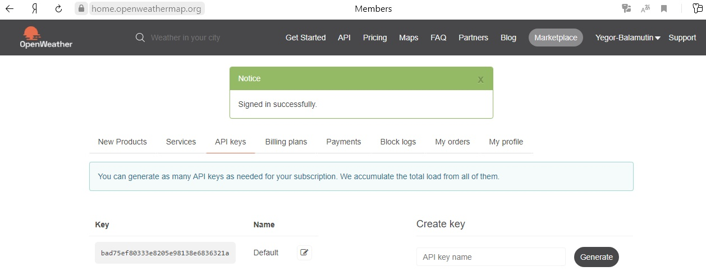

МИНИСТЕРСТВО НАУКИ  И ВЫСШЕГО ОБРАЗОВАНИЯ РОССИЙСКОЙ ФЕДЕРАЦИИ 

Федеральное государственное автономное образовательное учреждение высшего образования 

"КРЫМСКИЙ ФЕДЕРАЛЬНЫЙ УНИВЕРСИТЕТ им. В. И. ВЕРНАДСКОГО" 

ФИЗИКО-ТЕХНИЧЕСКИЙ ИНСТИТУТ 

Кафедра компьютерной инженерии и моделирования

 

<h3 align="center">Отчёт по лабораторной работе № 1  по дисциплине "Программирование"</h3>

  

студента 1 курса группы ПИ-б-о-201(1) 

Баламутин Егор Никитович 

направления подготовки 09.03.04 "Программная инженерия"

  

<table>

<tr><td>Научный руководитель  старший преподаватель кафедры  компьютерной инженерии и моделирования</td>

<td>(оценка)</td>

<td>Чабанов В.В.</td>

</tr>

</table>

  

Симферополь, 2020

## Постановка задачи

Разработать сервис предоставляющий данные о погоде в городе Симферополе на момент запроса.  В качестве источника данных о погоде используйте: http://openweathermap.org/. В состав сервиса входит: серверное приложение на языке С++ и клиентское приложение на языке Python.

Серверное приложение (далее Сервер) предназначенное для обслуживания клиентских приложений и минимизации количества запросов к сервису openweathermap.org. Сервер должен обеспечивать возможность получения данных в формате JSON и виде html виджета (для вставки виджета на страницу будет использоваться iframe).

Клиентское приложение должно иметь графический интерфейс отображающий сведения о погоде и возможность обновления данных по требованию пользователя.

## Выполнение работы

Вначале я зарегестрировался на сервисе openweathermap.org и в разделе API key получил свой ключ API: `"bad75ef80333e8205e98138e6836321a"`

Рис 1. Получение ключа API

Затем на странице  http://openweathermap.org/appid#use сервиса я изучил инструкции по работе с ключом API и созданию http-запросов. 
После этого я смог составить следующий запрос:

`"https://api.openweathermap.org/data/2.5/onecall?lat=44.9572&lon=34.1108&units=metric&exclude=current,minutely,daily,alerts&lang=ru&appid=bad75ef80333e8205e98138e6836321a"`

где:
*lat - широта
*lon - долгота
*lang - язык
*units - система мер
*exclude - поля, которые нужно исключить из ответа

При вводе этого запроса