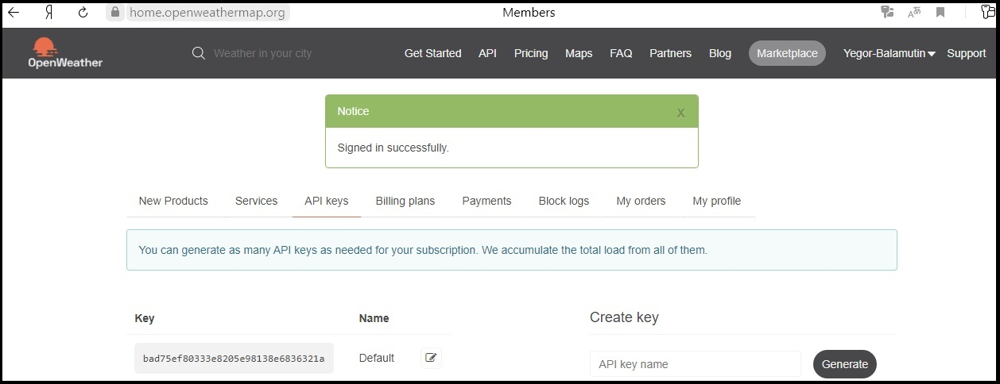

МИНИСТЕРСТВО НАУКИ  И ВЫСШЕГО ОБРАЗОВАНИЯ РОССИЙСКОЙ ФЕДЕРАЦИИ

Федеральное государственное автономное образовательное учреждение высшего образования

"КРЫМСКИЙ ФЕДЕРАЛЬНЫЙ УНИВЕРСИТЕТ им. В. И. ВЕРНАДСКОГО"

ФИЗИКО-ТЕХНИЧЕСКИЙ ИНСТИТУТ

Кафедра компьютерной инженерии и моделирования

 

<h3 align="center">Отчёт по лабораторной работе № 1  по дисциплине "Программирование"</h3>

  

студента 1 курса группы ПИ-б-о-201(1) 

Баламутин Егор Никитович 

направления подготовки 09.03.04 "Программная инженерия"

  

<table>

<tr><td>Научный руководитель  старший преподаватель кафедры  компьютерной инженерии и моделирования</td>

<td>(оценка)</td>

<td>Чабанов В.В.</td>

</tr>

</table>

  

Симферополь, 2020

## Цель работы
1. Закрепить навыки разработки многофайловыx приложений;
2. Изучить способы работы с API web-сервиса;
3. Изучить процесс сериализации/десериализации данных в/из json;
4. Получить базовое представление о сетевом взаимодействии приложений;

## Постановка задачи

Разработать сервис предоставляющий данные о погоде в городе Симферополе на момент запроса.
  В качестве источника данных о погоде использовать: http://openweathermap.org/. 
В состав сервиса входит: серверное приложение на языке С++ и клиентское приложение на языке Python.

Серверное приложение (далее Сервер) предназначенное для обслуживания клиентских приложений и
 минимизации количества запросов к сервису openweathermap.org. Сервер должен обеспечивать 
возможность получения данных в формате JSON и виде html виджета (для вставки виджета на страницу будет 
использоваться iframe).

Клиентское приложение должно иметь графический интерфейс отображающий сведения о погоде и 
возможность обновления данных по требованию пользователя.

## Выполнение работы

### Работа с сервисом openweathermap.org

Вначале я зарегестрировался на сервисе openweathermap.org и в разделе API key получил свой ключ API:`"bad75ef80333e8205e98138e6836321a"`

Рис 1. Получение ключа API

Затем на странице  http://openweathermap.org/appid#use сервиса я изучил инструкции по работе 
с ключом API и созданию http-запросов. 
После этого я смог составить следующий запрос:

`"http://api.openweathermap.org/data/2.5/onecall?lat=44.9572&lon=34.1108&units=metric&exclude=current,minutely,daily,alerts&lang=ru&appid=bad75ef80333e8205e98138e6836321a"`

где:
* `lat` - широта
* `lon` - долгота
* `lang` - язык
* `units` - система мер
* `exclude` - поля, которые нужно исключить из ответа

При вводе этого запроса сервис генерирует ответ в формате json:

Рис 2. Ответ сервиса openweather в формате json

Я изучил его структуру с помощью сервиса  JSON Viewer.
 Он содержит следующие поля: lat, lon, timezone, timezone_offset и массив hourly
 на 48 эллементов содержащий почасовой прогноз погоды на 48 часов. В элементах этого массива 
и содержится нужная информация. А именно в полях:

* `hourly[i]["dt"]` - значение времени, на которое был сделан прогноз
* `hourly[i]["temp"]` - значение температуры
* `hourly[i]["weather"][0]["description"]` - описание погоды
* `hourly[i]["weather"][0]["icon"]` - номер иконки (для виджета)

### Работа с сервисом worldtimeapi.org

Также для работы будующего приложения требуется знать текущее время. Для этого нужно воспользоватся 
сервисом worldtimeapi.org, который позваляет получить время в формате json. 
При вводе запроса `"http://worldtimeapi.org/api/timezone/Europe/Simferopol"` сервис генерирует ответ в формате json:

Рис 3. Ответ сервиса worldtimeapi.org в формате json

Нужное значение времени находится в поле `["unixtime"]`. По нему будующая программа будет искать 
подходящий элемент в массиве hourly.

### Серверное приложение

Серверное приложение написанно на языке C++. Оно принимает запрос, запрашивает данные с сервисов openweathermap.org и worldtimeapi.org 
и отправляет ответ в виде виджета либо в формате json. Так как сервис openweathermap.org отправляет данные о погоде 
на ближайшие 48 часов, то чтобы минимализировать запросы к нему, его ответ сохраняется в файл формата json (кеш). Я использовал 
библиотеку `httplib` для работы с сетью и библиотеку `nlohmann/json` для работы с форматом json.

В функции `main()` создаётся сервер. Указывается, что нужно вызвать функцию `gen_response()`, если кто-то обратится к корню сайта, 
а если обратятся на `/raw`, то вызвать функцию `gen_response_raw()`. Сервер запускается на `localhost:3000`.

")

Рис 4. функция main()

Прежде чем переходить к рассмотрению функций `gen_response()` и `gen_response_raw()` нужно рассмотреть функции `t_request()` и `w_request()`, 
которые выполняют запрос времени и погоды. Функция `t_request()` выполняет запрос к сервису worldtimeapi.org и возвращает 
значение поля `["unixtime"]`. Если запрос прошёл неудачно, то функция возвращает -1.

")

Рис 5. функция t_request()

Проверка на то, прошёл ли запрос удачно, выполняется с помощью функции `check_res(httplib::Result& res)`. Она принимает один 
параметр (ответ сервиса) и возвращает `true` если его статус равен 200.

Рис 6. функция check_res

Функция `w_request()` запрашивает данные у сервиса openweathermap.org, возвращает тело ответа, а также записывает его в кеш. 
Для обращения к сервису используется запрос, созданный ранее в пункте "Работа с сервисом openweathermap.org". Функция проверяет 
ответ сервиса с помощью описанной выше функции `check_res` и в случае ошибки возвращает пустой json вида `{}`.

")

Рис 7. функция w_request()

Функция `gen_response()` формирует и отправляет виджет погоды. В первой части функции запрашивается время с помощью функции `t_request()` и 
его значение помещается в переменную `ctime`. Затем создаётся переменная `json weather` для хранения и обработки ответа от openweathermap.org.
Так как ответ сервиса openweathermap.org программа хранит в файле `cache.json` то вначале она пытается открыть этот файл. Если он 
открылся, значит кеш существует и его содержимое записывается в `weather`. Если же открыть файл не удалось, значит он отсутствует. В таком 
случае выполняется запрос погоды с помощью функции `w_request()` и сразу выполняется проверка, прошёл ли он удачно.

")

Рис 8. Первая часть функции gen_response()

Далее в функции `gen_response()` вызывается функция `check_cache`. Эта функция первым аргументом принимает json с ответом сервиса
 openweathermap.org, а вторым аргументом принимает значение времени. Затем она ищет элемент в массиве `hourly` с подходящим значением 
времени и возвращает его индекс. При этом функция возвращает 48, если кеш устарел. Если же в функцию было передано неверное значение 
времени, то она возвращает -1.

Рис 9. Функция check_cache

Значение, которое вернула функция `check_cache`, записывается в переменную `t`. Далее выполняется проверка: если `t == 48` то кеш
 устарел и его нужно обновить. Выполняется запрос к openweathermap.org и затем снова вызывается функция `check_cache`.

Рис 10. Проверка результата функции check_cache

Далее выполлняется проверка на то, чтобы `t` было больше чем -1. Если условие выполняется, то можно переходить к формированию 
виджета.

Открывается файл widget.html (заготовленый шаблон виджета) и выполняется проверка на то, что он успешно открылся. 
Содержимое файла записывается в переменную `std::string widget`. Затем создаются строковые переменные `w_des`, `icon` и `temp` в которые 
из `json weather` записываются значения: описание погоды, номер иконки и округлённое значение температуры. Затем в шаблон (в переменную 
`widget`) подставляются эти значения с помощью функции `repl_val` (будет рассмотрена далее). В ответ на запрос отправляется 
готовый виджет.

Рис 11. Формирование и отправка виджета

Функция `repl_val` принимает шаблон виджета и три строки, которые нужно в него вставить. В ней создаются три переменные в которые помещаются 
строки, которые изначально есть в шаблоне и которые нужно заменить на полученные. Далее нужные строки подставляются в шаблон с помощью 
функции `rep_to` и возвращается готовый виджет.

Рис 12. Функция repl_val

Функция `rep_to`, которая использовалась в функции `repl_val`, принимает три строки: главную строку (шаблон виджета), подстроку 1 и подстроку 2. 
Она заменяет в главной строке подстроку 1 на подстроку 2 и возвращает исправленную строку. Вначале в переменную `a` записывается номер символа, 
с которого в главной строке начинается первая подстрока. Затем с помощью метода `.replace(a, size(s1), s2)` в главной строке начиная с символа 
под номером `a` стераются следующие `size(s1)` символов и на это место вставляется `s2`.

Рис 13. Функция rep_to

Если запустить серверное приложение и в браузере обратиться по адресу `http://localhost:3000/`, то пояявится страница с виджетом погоды.

Рис 14. Готовый виджет

Если же поступит запрос на `/raw`, то сервер запустит функцию `gen_response_raw()`. Эта функция формирует и отправляет json, содержащий 
информацию о погоде. Первая часть функции такая же как в функции `gen_response()` и после её выппполнения в пространстве имён функции 
есть переменная `json weather`, содержащая ответ сервиса openweathermap.org, и переменная `t`, хранящая индекс для нужного времени.

В последней части функции `gen_response_raw()` формируется ответ в формате json. Создаётся переменная `json raw`. По ключу `["weather_des"]` 
ей присваивается значение `weather["hourly"][t]["weather"][0]["description"]`, содержащее описание погоды. А по ключу `["temp"]` присваивается 
значение `weather["hourly"][t]["temp"]` (температура). Этот json отправляется в ответ на запрос.

")

Рис 15. Формирование ответа функцией gen_response_raw()

### Клиентское приложение

Клиентское приложение написано на языке Python. Оно имеет графический интерфейс, реализованный с помощью модуля Tkinter. Также 
были использованы модуль Json для работы с форматом json и модуль requests для работы с сетью. Однако модуль requests сначала 
нужно установить, прописав в терминале команду `pip install requests`.

Приложение посылает запрос на `http://localhost:3000/raw` и получает ответ от сервера в формате json. Ответ содержит значение 
температуры и описание погоды. По этим данным приложение заполняет виджет.

В начале программы подключаются необходимые модули. Затем формируется макет виджета. Создаётся переменная `root = Tk()`, которая 
и будет виджетом. В ней создаётся поле `simf`, содержащее текст "Симферополь". Под ним создаётся поле `status`, которое будет 
содержать описание погоды. Под этим полем создаётся поле `temp`, которое будет содержать температуру. Затем создаётся поле 
`bott` с выравниванием по низу, которое просто придаёт виджету лучший вид.

Рис 16. Формирование макета виджета

Далее в коде программы следует описание функций (будут рассмотрены далее) и за ними с помощью метода `.bind` определяется, что 
нужно вызвать функцию `upd` при нажатии ПКМ по любому полю виджета. Затем вызывается функция `req()`, в результате выполнения 
которой виджет заполняется, и с помощью метода `.mainloop` открывается виджет.

Рис 17. Последняя часть программы

Функция `req()` делает и обрабатывает запрос к серверу. В начале функции объявляются глобальные переменные:
* `t` - температура
* `stat` - описание погоды (либо сообщение об ошибке)
* `col` - цвет виджета (будет меняться в зависимости от температуры)
* `col_t` - цвет текста в поле со значением температуры (станет серым в случае ошибки)
* `pal` - массив, содержащий коды цветов (под разные значения температуры)

Затем выполняется запрос к серверу и проверяется его статус. Если статус ответа не равен 200 или ответ пустой, то глобальные 
переменные заполняются значениями, соответствующими ошибке. Если же ответ нормальный, то создаётся переменная типа json, 
в которую помещается ответ сервера и глобальные переменные заполняются соответствующими значениями. В конце функции `req()` 
вызывается функция `put_to_wid()` которая заполняет виджет.

")

Рис 18. Функция req()

В начале функции `put_to_wid()` объявляются те же глобальные переменные, что и в функции `req()`, но к ним добавляются ещё и 
поля виджета: `simf`, `status`, `temp`, `bott`. Функция просто заполняет параметры этих полей соответствующими значениями.

")

Рис 19. Функция put_to_wid()

Если пользователь захочет обновить данные (например, в случае ошибки), то он должен нажать ПКМ на любое поле виджета. Это 
вызовет функцию `upd()`. Эта функция принимает один параметр (`event`) и просто вызывает функцию `req()`.

")

Рис 20. Функция upd()

Если запустить клиентское приложение, то появится окно виджета. Оно имеет следующий вид:

Рис 21. Вид клиентского приложения

## Вывод
В процессе выполнения данной работы я получил базовые знания по разработке многофайловыx приложений, изучил структуру web-запроса 
и способы работы с API web-сервиса, закрепил навыки работы с файлами и переменными формата json. Также я получил базовое 
представление о сетевом взаимодействии приложений.