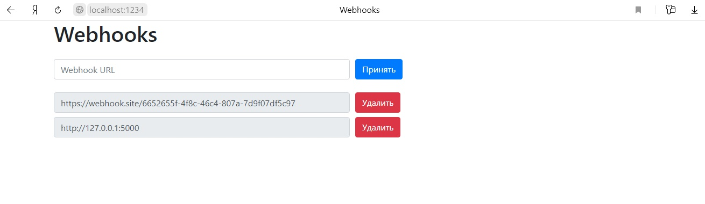
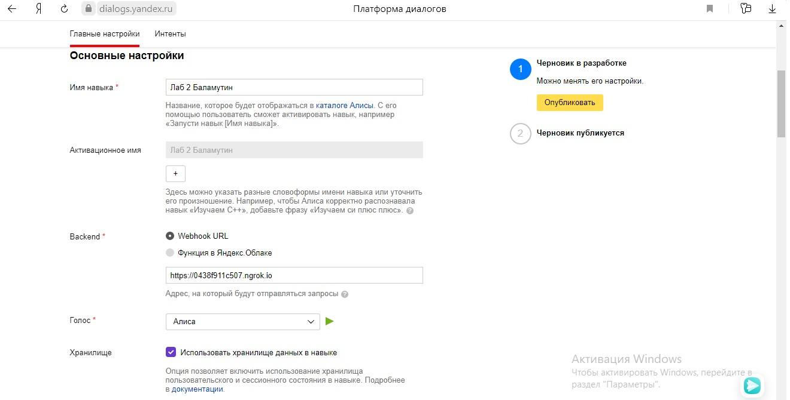
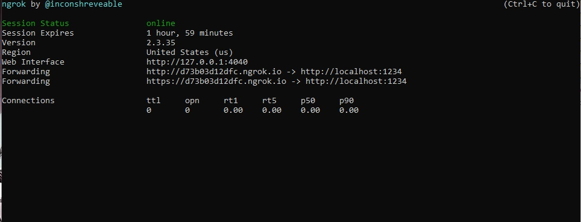

<p align="center">МИНИСТЕРСТВО НАУКИ  И ВЫСШЕГО ОБРАЗОВАНИЯ РОССИЙСКОЙ ФЕДЕРАЦИИ</p>

<p align="center">Федеральное государственное автономное образовательное учреждение высшего образования</p>

<p align="center">"КРЫМСКИЙ ФЕДЕРАЛЬНЫЙ УНИВЕРСИТЕТ им. В. И. ВЕРНАДСКОГО"</p>

<p align="center">ФИЗИКО-ТЕХНИЧЕСКИЙ ИНСТИТУТ</p>

<p align="center">Кафедра компьютерной инженерии и моделирования</p>

<br>

<h3 align="center">Отчёт по лабораторной работе № 2<br> по дисциплине "Программирование"</h3>

<br><br>

<p>студента 1 курса группы ПИ-б-о-201(1)<br>

Баламутин Егор Никитович<br>

направления подготовки 09.03.04 "Программная инженерия"</p>

<br><br>

<table>

<tr><td>Научный руководитель<br> старший преподаватель кафедры<br> компьютерной инженерии и моделирования</td>

<td>(оценка)</td>

<td>Чабанов В.В.</td>

</tr>

</table>

<br><br>

<p align="center">Симферополь, 2020</p>

<hr>

## Цель работы
1. Получить представления о структуре post-запроса;
2. Изучить webhooks как метод взаимодействия web-приложений;

## Постановка задачи

1. Разработать и зарегистрировать навык для Алисы на сервисе Яндекс.Диалоги;
2. В качестве backend-a для навыка реализовать приложение на языке С++ выполняющее следующие функции:
 1. Составление продуктовой корзины:
  * Добавление продукта в корзину;
  * Удаление продукта из корзины;
  * Очистка корзины;
  * Вывод списка товаров в корзине;
  * Подсчёт стоимости товаров в корзине.
 2. Вывод справочной информации по навыку;
 3. Регистрацию webhook-ов сторонних сервисов;
 4. Отправку данных на сторонние сервисы.
3. В качестве стороннего сервиса реализовать приложение на языке Python выполняющее следующие функции:
 1. Ожидание данных о покупке;
 2. Сохранение поступивших данных в excel-документ.

## Выполнение работы

### Серверная часть

Серверная часть отвечает за взаимодействие с Алисой, а так же за обработку и дальнейшую пересылку данных 
подчинённым сервисам. Язык серверного приложения: С++. 
Для работы с сетью используется библиотека `cpp_httplib`. Для работы с форматом json используется библиотека 
`nlohmann/json`. Так как иногда сервер должен выводить русский текст, то сообщения сервера выводятся не 
в консоль, а в файл log.txt. Для этого в коде создаётся глобальный файловый поток: `std::ofstream logger("log.txt");` 
и все сообщения выводятся в него.

Так выглядит функция main() серверного приложения:

```
int main() {
    Server svr;
    svr.Post("/webhooks", gen_res_edit_webhooks);
    svr.Get("/webhooks", gen_res_webhooks);
    svr.Post("/", gen_res_alice);
    std::cout << u8"Starting server... OK\n";
    logger << u8"Starting server... OK\n";
    svr.listen("localhost", 1234);
}
```

#### Создание инструмента для регистрации вебхуков

Сервер взаимодействует с подчинёнными сервисами посредством Webhook-ов. Поэтому понадобился способ их регистрации 
и удаления во время работы сервера. Для этого в коде реализованы соответствующие функции.

При обращении по адресу [http://localhost:1234/webhooks](http://localhost:1234/webhooks) на сервер поступит Get-запрос. 
В результате запустится функция `gen_res_webhooks`:

```
void gen_res_webhooks(const Request& req, Response& res) {
    logger << u8"Recived a Get-request on \"\\webhooks\"\n";
    std::string html_temp = gen_html();
    // отправка заполненного html шаблона
    res.set_content(html_temp, "text/html");
    logger << u8"response sent\n";
    logger << u8"function gen_response_webhooks finished" << std::endl << std::endl;
}
```

В ней с помощью функции `gen_html()` создаётся строка, содержащая заполненный html-шаблон, который отправляется в 
качестве ответа клиенту.

Функция `gen_html()` выглядит так:

```
// Функция заполняет html шаблон по файлу конфигурации и возвращает его в виде строки
std::string gen_html() {
    logger << u8"Starting function gen_html\n";
    // загрузка файла конфигурации
    json conf;
    std::ifstream file1("configuration.json");
    if (file1.is_open()) {
        logger << u8"conf file is opened\n";
        file1 >> conf;
        file1.close();
    }
    else {
        logger << u8"conf file is not founded\n";
        conf["webhooks"] = json::array();
        std::ofstream file1("configuration.json");
        file1 << std::setw(2) << conf;
        file1.close();
    }
    // чтение html шаблона
    std::ifstream file2("dashboard.html");
    std::string html_temp;
    if (file2.is_open()) {
        std::getline(file2, html_temp, '\0');
    }
    else {
        logger << u8"failed open html file\n";
        logger << u8"function gen_response_webhooks finished\n";
        return "";
    }
    // заполнение html шаблона
    std::string plug = u8"{webhooks_list}";
    if (size(conf[u8"webhooks"]) == 0) {
        logger << u8"no any webhooks\n";
    }
    else {
        logger << u8"existing webhooks:\n";
        std::string webhook = u8R"(
     <div class="form-row align-items-center">
        <div class="col">
        <input type="text" value="{Webhook URL}" class="form-control mb-2" disabled>
        </div>
 
        <div class="col">
            <button type="submit" name="del" value="{Webhook URL}" class="btn btn-danger mb-2">Удалить</button>
        </div>
     </div>)";
        webhook += plug;
        std::string plug1 = u8"{Webhook URL}";
        for (std::string i : conf["webhooks"]) {
            logger << u8"   " << i << std::endl;
            html_temp = html_temp.replace(html_temp.find(plug), size(plug), webhook);
            html_temp = html_temp.replace(html_temp.find(plug1), size(plug1), i);
            html_temp = html_temp.replace(html_temp.find(plug1), size(plug1), i);
        }
    }
    html_temp = html_temp.replace(html_temp.find(plug), size(plug), "");
    return html_temp;
```

Вначале в функции открывается файл конфигурации формата `json` и его содержание записывается в переменную `conf`. 
Если же файл не найден то он создаётся и имеет следующую структуру:

```
{
    "webhooks":[]
}
```

Затем открывается файл "dashboard.html", содержащий шаблон страницы и его содержание записывается в переменную `html_temp`. 
Далее если зарегистрированных вебхуков нет, то функция возвращает шаблон, в котором просто удалена заглушка "{webhooks_list}". 
Если же вебхуки есть, то цикл проходится по всем элементам массива webhooks и добавляет каждый из них к шаблону.

Поэтому при обращении по адресу [http://localhost:1234/webhooks](http://localhost:1234/webhooks) клиент увидит такую страницу:


<p align="center">Рис 1. Пример страницы с двумя зарегестрированными вебхуками</p>

В поле "Webhook URL" пользователь может ввести новый вебхук и нажать"принять" чтобы добавить его либо он может нажать 
"удалить" напротив вебхука чтобы удалить его. Нажатие на любую из кнопок на странице приводит к отправке post-запроса 
на /webhooks, в результате чего запустится функция `gen_res_edit_webhooks`. Если нажата кнопка Принять в запрос добавляется 
параметр set со значением равным тексту указанному в поле ввода которое вводится пользователем. Если нажата кнопка Удалить, 
в запрос добавляется параметр del со значением из соседнего поля ввода.

Функция `gen_res_edit_webhooks`:

```
// В этой функции добавляется или удаляется вебхук и отправляется ответ
void gen_res_edit_webhooks(const Request& req, Response& res) {
    logger << u8"Recived a Post-request on \"\\webhooks\"\n";
    // Открытие конфигурационного файла
    json conf;
    std::ifstream file1("configuration.json");
    if (file1.is_open()) {
        logger << u8"conf file is opened\n";
        file1 >> conf;
        file1.close();
    }
    else {
        logger << u8"conf file is not founded\n";
        return;
    }
    // Проверка на то, поступил ли запрос на добавление или на удаление
    if (req.has_param("del")) {
        logger << u8"request for deliting \"" << req.get_param_value("del") << "\"\n";
        auto val = req.get_param_value("del");
        // удаление из файла конфигурации
        for (int i = 0; i < size(conf["webhooks"]); i++) {
            if (conf["webhooks"][i] == val) {
                conf["webhooks"].erase(conf["webhooks"].begin() + i);
                break;
            }
        }
    }
    else {
        logger << u8"request for adding \"" << req.get_param_value("set") << "\"\n";
        // добавление в файл конфигурации
        auto val = req.get_param_value("set");
        conf["webhooks"].push_back(val);
    }
    // Запись изменений в файл
    std::ofstream file2("configuration.json");
    file2 << std::setw(2) << conf;
    file2.close();
    // Формируем и отправляем ответ
    std::string str = gen_html();
    res.set_content(str, "text/html; charset=UTF-8");
    logger << u8"function gen_res_edit_webhooks finished" << std::endl << std::endl;
}
```

В начале этой функции также открывается файл конфигурации и его значение записывается в переменную `conf`. 
Далее если поступил запрос на добавление, то в переменную `conf` добавляется соответствующее значение, а 
если на удаление, то из переменной `conf` удаляется соответствующее значение. Затем изменения записываются 
в файл конфигурации и вызывается функция `gen_html()`, которая генерирует ответ по этому файлу. Последним шагом 
в функции отправляется этот ответ.

#### Создание навыка для Алисы

Я зашёл со своего аккаунтана сервис Яндекс.Диалоги и создал навык в Алисе. Для создания навыка нужно выставить 
его настройки:


<p align="center">Рис 2. Настройки навыка для Алисы</p>

При этом в пункте backend нужно выбрать Webhook URL и указать адрес, на который будут отправляться запросы. 
Чтобы localhost был доступен из интернета, нужно воспользоватся приложением ngrok. Запускаем ngrok.exe и 
пишем команду: `ngrok.exe http 1234`. Приложение укажет адрес, при обращении по которому запросы будут приходить 
на `http://localhost:1234`:


<p align="center">Рис 3. Запущенное приложение ngrok</p>

Именно этот адрес нужно указать в настройках навыка. Но при перезапуске ngrok.exe адрес меняется, поэтому нужно 
изменять его и в настройках навыка.

#### Обработка запросов от Алисы

Итак, Алиса отправляет Post-запросы, которые приходят на `http://localhost:1234`. На сервере в этом случае запускается 
функция `gen_res_alice`:

```
// Функкция принимает Post-запрос от Алисы и отправляет ответ
void gen_res_alice(const Request& req, Response& res) {
    logger << u8"Recived a Post - request on \"/\"\n";
    json j_req = json::parse(req.body);
    // создание макета ответа в формате json
    json j_res;
    std::string str = u8R"(
        {
            "response": {
                "text": "Здравствуйте! Я помогу вам с покупками.",
                "tts": "Здравствуйте! Я помогу вам с покупками.",
                "buttons": [
                    {
                        "title": "Молчать",
                        "payload": {},
                        "hide": true
                    },
                    {
                        "title": "Помощь",
                        "payload": {},
                        "hide": true
                    }
                ],
                "end_session": false
            },
            "session_state": {
                "talk": true,
                "help_mode": false,
                "basket": {}
            },
            "version": "1.0"
        }
        )";
    j_res = json::parse(str);
    // если сессия новая, то посылаем макет ответа без изменений
    if (j_req["session"]["new"]) {
        logger << u8"session is new\n";
    }
    else {
        logger << u8"session isn't new\n";
        // проверка сессионных данных
        if (!(j_req["state"]["session"].count("talk") && j_req["state"]["session"].count("help_mode") && j_req["state"]["session"].count("basket"))) {
            logger << u8"session data not found\n";
            j_res["response"]["text"] = u8"Произошла ошибка";
            j_res["response"]["tts"] = u8"произошла ошибка";
            j_res["response"]["buttons"] = json::array();
            j_res["response"]["end_session"] = true;
            res.set_content(j_res.dump(), "text/json; charset=UTF-8");
            logger << u8"response sent\n" << std::endl;
            return;
        }
        j_res["session_state"] = j_req["state"]["session"];
        // если режим помощи не включен
        if (!(j_req["state"]["session"]["help_mode"])) {
            if (j_res["session_state"]["talk"]) j_res["response"]["buttons"][0]["title"] = u8"Молчать";
            else j_res["response"]["buttons"][0]["title"] = u8"Говорить";
            if (j_req["request"]["nlu"]["tokens"][0] == u8"молчать") {
                logger << u8"recived a command to be quiet\n";
                j_res["session_state"]["talk"] = false;
                j_res["response"]["text"] = u8"Молчу, молчу.";
                j_res["response"]["tts"] = u8"sil <[500]>";
                j_res["response"]["buttons"][0]["title"] = u8"Говорить";
            }
            else {
                if (j_req["request"]["nlu"]["tokens"][0] == u8"говорить") {
                    logger << u8"recived a command to talk\n";
                    j_res["session_state"]["talk"] = true;
                    j_res["response"]["text"] = u8"Хорошо.";
                    j_res["response"]["tts"] = u8"хорошо";
                    j_res["response"]["buttons"][0]["title"] = u8"Молчать";
                }
                else {
                    if (j_req["request"]["nlu"]["tokens"][0] == u8"помощь") {
                        logger << u8"recived a command to help\n";
                        j_res["session_state"]["help_mode"] = true;
                        j_res["response"]["text"] = u8"Корзина. Поможет организовать покупки.\nO чём рассказать подробнее?";
                        if (j_res["session_state"]["talk"]) j_res["response"]["tts"] = u8"O чём рассказать подробнее?";
                        else j_res["response"]["tts"] = u8"sil <[500]>";
                        j_res["response"]["buttons"][0]["title"] = u8"Корзина";
                        j_res["response"]["buttons"][0]["payload"] = "{}";
                        j_res["response"]["buttons"][0]["hide"] = true;
                        j_res["response"]["buttons"][1]["title"] = u8"Назад";
                        j_res["response"]["buttons"][1]["payload"] = "{}";
                        j_res["response"]["buttons"][1]["hide"] = true;
                    }
                    else {
                        if ((j_req["request"]["nlu"]["tokens"][0] == u8"очистить") && (j_req["request"]["nlu"]["tokens"][1] == u8"корзину")) {
                            logger << u8"recived a command to clear basket\n";
                            j_res["session_state"]["basket"] = json::object();
                            j_res["response"]["text"] = u8"Корзина очищена.";
                            if (j_res["session_state"]["talk"]) j_res["response"]["tts"] = u8"корзина очищена";
                            else j_res["response"]["tts"] = u8"sil <[500]>";
                        }
                        else {
                            if ((size(j_req["request"]["nlu"]["tokens"]) == 6) && ((j_req["request"]["nlu"]["tokens"][0] == u8"добавить") && (j_req["request"]["nlu"]["tokens"][1] == u8"в") && (j_req["request"]["nlu"]["tokens"][2] == u8"корзину"))) {
                                std::string name = j_req["request"]["nlu"]["tokens"][3];
                                int price = j_req["request"]["nlu"]["entities"][0]["value"];
                                logger << u8"recived a command to add " << name << u8" " << price << u8" " << j_req["request"]["nlu"]["tokens"][5] << "\n";
                                j_res["session_state"]["basket"][name] = price;
                                j_res["response"]["text"] = u8"Товар добавлен.";
                                if (j_res["session_state"]["talk"]) j_res["response"]["tts"] = u8"товар добавлен";
                                else j_res["response"]["tts"] = u8"sil <[500]>";
                            }
                            else {
                                if ((size(j_req["request"]["nlu"]["tokens"]) == 3) && ((j_req["request"]["nlu"]["tokens"][0] == u8"что") && (j_req["request"]["nlu"]["tokens"][1] == u8"в") && (j_req["request"]["nlu"]["tokens"][2] == u8"корзине"))) {
                                    logger << u8"recived a command to show basket\n";
                                    if (j_res["session_state"]["basket"] == json::object()) {
                                        j_res["response"]["text"] = u8"Корзина пуста.";
                                        if (j_res["session_state"]["talk"]) j_res["response"]["tts"] = u8"корзина пуста";
                                        else j_res["response"]["tts"] = u8"sil <[500]>";
                                    }
                                    else {
                                        std::string s = u8"Вот что есть в корзине:\n";
                                        std::string name;
                                        int price;
                                        for (auto product = j_res["session_state"]["basket"].begin(); product != j_res["session_state"]["basket"].end(); ++product) {
                                            name = product.key();
                                            price = product.value();
                                            s = s + name + " " + std::to_string(price) + u8" руб\n";
                                        }
                                        j_res["response"]["text"] = s;
                                        if (j_res["session_state"]["talk"]) j_res["response"]["tts"] = u8"вот что есть в корзине";
                                        else j_res["response"]["tts"] = u8"sil <[500]>";
                                    }
                                }
                                else {
                                    if ((size(j_req["request"]["nlu"]["tokens"]) == 4) && ((j_req["request"]["nlu"]["tokens"][0] == u8"удалить") && (j_req["request"]["nlu"]["tokens"][1] == u8"из") && (j_req["request"]["nlu"]["tokens"][2] == u8"корзины"))) {
                                        logger << u8"recived a command to delite " << j_req["request"]["nlu"]["tokens"][3] << "\n";
                                        json copy_basket = json::object();
                                        std::string del_obj = j_req["request"]["nlu"]["tokens"][3];
                                        bool found = false;
                                        for (auto product : j_res["session_state"]["basket"].items()) {
                                            if (product.key() == del_obj) found = true;
                                            else copy_basket[product.key()] = product.value();
                                        }
                                        if (found) {
                                            j_res["response"]["text"] = u8"Товар удалён.\n";
                                            if (j_res["session_state"]["talk"]) j_res["response"]["tts"] = u8"товар удалён";
                                            else j_res["response"]["tts"] = u8"sil <[500]>";
                                            j_res["session_state"]["basket"] = copy_basket;
                                        }
                                        else {
                                            j_res["response"]["text"] = u8"В корзине нет такого товара.\n";
                                            if (j_res["session_state"]["talk"]) j_res["response"]["tts"] = u8"в корзине нет такого товара";
                                            else j_res["response"]["tts"] = u8"sil <[500]>";
                                        }
                                    }
                                    else {
                                        if (j_req["request"]["nlu"]["tokens"][0] == u8"сумма") {
                                            logger << u8"recived a command to count price\n";
                                            int count = 0;
                                            for (auto product : j_res["session_state"]["basket"].items()) {
                                                count += product.value();
                                            }
                                            j_res["response"]["text"] = u8"Суммарная стоимость: " + std::to_string(count) + u8" руб\n";
                                            if (j_res["session_state"]["talk"]) j_res["response"]["tts"] = u8"сумарная стоимость " + std::to_string(count) + u8" рублей";
                                            else j_res["response"]["tts"] = u8"sil <[500]>";
                                        }
                                        else {
                                            if ((size(j_req["request"]["nlu"]["tokens"]) == 2) && ((j_req["request"]["nlu"]["tokens"][0] == u8"покупка") && (j_req["request"]["nlu"]["tokens"][1] == u8"завершена"))) {
                                                logger << u8"recived a command to finish purchase\n";
                                                j_res["response"]["text"] = u8"Заходите ещё.";
                                                if (j_res["session_state"]["talk"]) j_res["response"]["tts"] = u8"заходите ещё";
                                                else j_res["response"]["tts"] = u8"sil <[500]>";
                                                j_res["response"]["end_session"] = true;
                                                if (j_res["session_state"]["basket"] == json::object()) {
                                                    logger << u8"no any products in the basket\n";
                                                }
                                                else {
                                                    json purchase = json::object();
                                                    if (j_req["session"]["user"].count("user_id")) purchase["user_id"] = j_req["session"]["user"]["user_id"];
                                                    else purchase["user_id"] = "anonymous";
                                                    purchase["check"] = json::array();
                                                    int i = 0;
                                                    for (auto product : j_res["session_state"]["basket"].items()) {
                                                        purchase["check"].push_back(json::object());
                                                        purchase["check"][i][product.key()] = product.value();
                                                        i++;
                                                    }
                                                    send_purch(purchase);
                                                }
                                            }
                                            else {
                                                logger << u8"recived an unknown command\n";
                                                j_res["response"]["text"] = u8"Я не понимаю.";
                                                if (j_res["session_state"]["talk"]) j_res["response"]["tts"] = u8"я не понимаю";
                                                else j_res["response"]["tts"] = u8"sil <[500]>";
                                            }
                                        }
                                    }
                                }
                            }
                        }
                    }
                }
            }
        }
        // если режим помощи включен
        else {
            j_res["response"]["buttons"][0]["title"] = u8"Корзина";
            j_res["response"]["buttons"][1]["title"] = u8"Назад";
            if (j_req["request"]["nlu"]["tokens"][0] == u8"корзина") {
                logger << u8"recived a command to tell about basket\n";
                j_res["response"]["text"] = u8R"(
                Команды для корзины:
                "Добавить в корзину [название товара] [цена] рублей" - добавляет товар в корзину.
                "Удалить из корзины [название товара]" - удаляет товар из корзины.
                "Очистить корзину" - очищает корзину.
                "Что в корзине" - выводит список товаров из корзины.
                "Покупка завершена" - отсылает всем подписавшимся список покупок из корзины.
                О чём ещё рассказать?
                )";
                if (j_res["session_state"]["talk"]) j_res["response"]["tts"] = u8"команды для корзины";
                else j_res["response"]["tts"] = u8"sil <[500]>";
            }
            else {
                if (j_req["request"]["nlu"]["tokens"][0] == u8"назад") {
                    logger << u8"recived a command to dont help\n";
                    j_res["response"]["text"] = u8"Обращайся ещё.";
                    if (j_res["session_state"]["talk"]) j_res["response"]["tts"] = u8"Обращайся ещё";
                    else j_res["response"]["tts"] = u8"sil <[500]>";
                    j_res["session_state"]["help_mode"] = false;
                    if (j_res["session_state"]["talk"]) j_res["response"]["buttons"][0]["title"] = u8"Молчать";
                    else j_res["response"]["buttons"][0]["title"] = u8"Говорить";
                    j_res["response"]["buttons"][1]["title"] = u8"Помощь";
                }
                else {
                    logger << u8"recived an unknown command\n";
                    j_res["response"]["text"] = u8"Я не понимаю.";
                    if (j_res["session_state"]["talk"]) j_res["response"]["tts"] = u8"я не понимаю";
                    else j_res["response"]["tts"] = u8"sil <[500]>";
                }
            }
        }
    }
    res.set_content(j_res.dump(), "text/json; charset=UTF-8");
    logger << u8"response sent\n" << std::endl;
}
```

В теле запроса от Алисы лежит объект json. Тело запроса помещается в переменную `j_req`. Ответ также должен быть 
в формате json. Макет ответа помещается в переменную `j_res`.

Поле `[session_state]` хранит информацию о корзине, 
а также о том, включен ли режим помощи и нужно ли дублировать текст голосом. Это поле нужно каждый раз передовать в 
ответе Алисе, а она будет возвращать эту информацию при следующем запросе. Это позволяет хранить сессионные данные в 
навыке.

При получении очередного запроса от Алисы вначале проверяется поле `["session"]["new"]` и если сессия новая, то макет 
ответа отправляется без изменений. Если же сессия не новая, то из запроса достаются сессионные данные из поля 
`["state"]["session"]` и помещаются в поле ответа `[session_state]`.

Далее по этим данным проверяется, включен ли режим помощи. Если режим помощи не включен, то следующим действием выполняется 
проверка, включено ли голосовое сопровождение, и в зависимости от результата первой кнопке присваивается заголовок 
"Молчать" или "Говорить". Далее выполняется поочерёдная проверка сообщения пользователя на соответствие какой-либо команде. 
Если соответствие найдено, то выполняется соответствующая операция, обновляются сессионные данные и отправляется ответ. 
Если после всех проверок соответствие не найдено, то в тексте ответа отправляется соответствующее сообщение.

Если же режим помощи включен, то вначаче заголовкам кнопок присваиваются значения "Корзина" и "Назад". Затем также 
выполняется ряд проверок на соответствие командам, доступным в режиме помощи и отправляется соответствующий ответ.

Все функции навыка перечисленны выше в разделе "Постановка задачи". Алгоритм их реализации не сложный и не требует 
подробного описания.

Демонстрация работы некоторых функций навыка:


<p align="center">Рис 4. Функция "помощь"</p>


<p align="center">Рис 5. Функции "добавить" и "сумма"</p>


<p align="center">Рис 6. Функции "что в корзине" и "удалить"</p>


<p align="center">Рис 7. Функция "очистить корзину"</p>

Отдельно стоит выделить команду "Покупка завершена". Если поступила эта команда, то сессия завершается, а на все зарегестрированные 
вебхуки отправляется json содержащий список покупок и id пользователя.

Когда поступает команда "Покупка завершена", то сессия завершается, и если в корзине есть товары, то создаётся переменная 
`json purchase` в которую записывается содержание корзины а также id пользователя. Она имеет такую структуру:

```
{
  "check": [
    {
      "овощи": 345
    },
    {
      "фрукты": 478
    }
  ],
  "user_id": "24C22CC51AF85FD5801CBA669C86D7CFEDBE1E15D4D05C61A420D3202A6FB120"
}
```

Переменная `purchase` передаётся в функцию `send_purch`:

```
// Функция принимает json с покупками и отправляет его всем зарегестрированным вебхукам
void send_purch(json purchase) {
    logger << u8"Starting function send_purch\n";
    // загрузка файла конфигурации
    json conf;
    std::ifstream file1("configuration.json");
    if (file1.is_open()) {
        logger << u8"conf file is opened\n";
        file1 >> conf;
        file1.close();
    }
    else {
        logger << u8"conf file is not founded\n";
        return;
    }
    // цикл проходится по всем элементам массива webhooks
    for (auto item : conf["webhooks"].items()) {
        std::string webhook = item.value();
        std::string domen = "";
        std::string path = "/";
        int slash = 0;
        int i = 0;
        // цикл выделяет домен из вебхука (домен - первая часть вебхука до третьего появления символа '/'
        while (i < size(webhook)) {
            if (webhook[i] == '/') slash++;
            if (slash == 3) break;
            else domen += webhook[i];
            i++;
        }
        i++;
        // цикл выделяет оставшуюся часть вебхука
        while (i < size(webhook)) {
            path += webhook[i];
            i++;
        }
        logger << u8"webhook: " << webhook << "\n";
        if (domen[4] == 's') {
            domen.erase(4, 1);
            logger << u8"changed https to http\n";
        }
        logger << u8"domen: " << domen << "\n";
        logger << u8"path: " << path << "\n";
        // отправка json purchase на вебхук
        logger << u8"sending request on webhook... ";
        Client cli(domen.c_str());
        auto res = cli.Post(path.c_str(), purchase.dump(), "application/json");
        // res преобразуется в true, если запрос-ответ прошли без ошибок
        if (res) {
            // Проверяем статус ответа, т.к. может быть 404 и другие
            if (res->status == 200) {
                // В res->body лежит string с ответом сервера
                logger << u8"OK. Response: " << res->body << std::endl;
            }
            else {
                logger << u8"Status code: " << res->status << std::endl;
            }
        }
        else {
            auto err = res.error();
            logger << u8"Error code: " << err << std::endl;
        }
    }
    logger << u8"function send_purch finished\n";
}
```

В начале функции открывается конфигурационный файл и его содержимое записывается в переменную. Далее цикл 
проходится по всем элементам массива "webhooks". Каждый элемент - это строка, представляющая собой вебхук. 
Затем вебхук разделяется на домен и путь (домен заканчивается после третьего появления в строке символа"/") 
и отправляется Post-запрос содержащий `json purchase`.

### Клиентское приложение

Клиентское приложение предназначено для получения данных от сервера и сохранения их в excel-документ. Язык 
клиентского приложения: Python. Для работы с сетью используется микрофреймворк flask. Для работы с форматом 
xlsx используется модуль openpyxl.

В начале программы выполняется попытка открыть файл "data.xlsx" и записать его в переменную `book`, а 
переменной `sheet` присвоить значение первого листа.

Если файл не найден, то в переменную `book` записывается новая пустая книга, а в переменную `sheet` - 
первый лист этой книги. Затем создаётся шапка таблицы, после чего книга сохраняется.

```
try:
    book = openpyxl.open("data.xlsx", read_only=False)
    print("data.xlsx found")
    sheet = book.active
except FileNotFoundError:
    print("data.xlsx not found")
    book = openpyxl.Workbook()
    sheet = book.active
    sheet.cell(row=1, column=1).value = "N"
    sheet.cell(row=1, column=2).value = "User ID"
    sheet.cell(row=1, column=3).value = "Datetime"
    sheet.cell(row=1, column=4).value = "Item"
    sheet.cell(row=1, column=5).value = "Prise"
    book.save("data.xlsx")
```

Далее создаётся список `buf` в который будут сохранятся пришедшие запросы. Затем объявляется, что если 
прийдёт Get или Post запрос к корню, то нужно вызвать функцию `index`.

```
buf = []
 
app = Flask(__name__)
 
@app.route('/', methods=['POST', 'GET'])
def index():
    buf.append(request.json)
    buf[len(buf) - 1]["datetime"] = datetime.datetime.now().ctime()
    if len(buf) > 2:
        data_save_xl(buf)
        buf.clear()
    return "OK"
 
if __name__ == "__main__":
    app.run()
```

В самой функции `index` в буфер добавляется json из пришедшего запроса. Также к этому json-у добавляется поле ["datetime"] 
содержащее значение даты и времени в момент добавления. Затем если размер буфера превышает 2, то его содержимое сохраняется 
в файл с помощью функции `data_save_xl` и буфер очищается.

```
def data_save_xl(buf):
    print("saving data")
    current_row = sheet.max_row + 1
    num = find_num(sheet)
    for i in range(len(buf)):
        sheet.cell(row=current_row, column=1).value = num
        num += 1
        sheet.cell(row=current_row, column=2).value = buf[i]["user_id"]
        sheet.cell(row=current_row, column=3).value = buf[i]["datetime"]
        for j in range(len(buf[i]["check"])):
            sheet.cell(row=current_row, column=4).value = str(j+1) + ": " + tuple(buf[i]["check"][j].items())[0][0]
            sheet.cell(row=current_row, column=5).value = tuple(buf[i]["check"][j].items())[0][1]
            current_row += 1
    book.save("data.xlsx")
```

В функции `data_save_xl` переменной current_row присваивается значение максимального используемого ряда + 1. 
Вычисляется значение для переменной num c помощью 
функции `find_num` (Функция начинает с максимального ряда и поднимается вверх по первому столбцу, пока не найдёт 
ячейку со значением. Это значение - номер последней записи. Она возвращает этот номер + 1). 

```
def find_num(sheet):
    num = 1
    for i in range(sheet.max_row, 1, -1):
            if (sheet.cell(row=i, column=1).value != None):
                num = sheet.cell(row=i, column=1).value + 1
                break
    return num
```

Далее в цикле рассматривается каждый элемент из списка buf. В ячейки ряда current_row в соответствующие колонки записываются 
соответствуюшие значения из `buf[i]`. Для 4 (item) и 5 (price) колонок запускается вложеный цикл. В массиве `check` может быть 
несколько покупок, каждая покупка записывается с новой строчки. Затем current_row увеличивается на 1.

Последним действием функция сохраняет book как "data.xlsx".

Вот так выглядит [Заполненный программой файл](materials/data.xlsx)

## Вывод
В процессе выполнения данной работы я получил представления о структуре post-запроса, изучил, что такое webhook и как его 
можно использовать для взаимодействия web-приложений. Мною были написаны 2 программы (клиент и сервер) и мне удалось реализовать 
все требуемые функции.