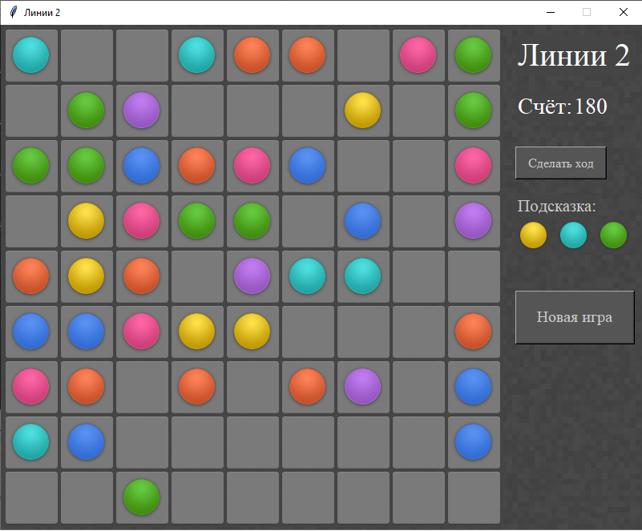

МИНИСТЕРСТВО НАУКИ  И ВЫСШЕГО ОБРАЗОВАНИЯ РОССИЙСКОЙ ФЕДЕРАЦИИ

Федеральное государственное автономное образовательное учреждение высшего образования

"КРЫМСКИЙ ФЕДЕРАЛЬНЫЙ УНИВЕРСИТЕТ им. В. И. ВЕРНАДСКОГО"

ФИЗИКО-ТЕХНИЧЕСКИЙ ИНСТИТУТ

Кафедра компьютерной инженерии и моделирования

 

<h3 align="center">Отчёт по лабораторной работе № 3  по дисциплине "Программирование"</h3>

  

студента 1 курса группы ПИ-б-о-201(1) 

Баламутин Егор Никитович 

направления подготовки 09.03.04 "Программная инженерия"

  

<table>

<tr><td>Научный руководитель  старший преподаватель кафедры  компьютерной инженерии и моделирования</td>

<td>(оценка)</td>

<td>Чабанов В.В.</td>

</tr>

</table>

  

Симферополь, 2020

## Цель работы

1. Закрепить навыки разработки программ с простым графическим интерфейсом пользователя на зыке Python при помощи библиотеки Tkinter;
2. Получить представление о разработке простых игровых приложений.

## Постановка задачи

1.Используя стандартный модуль для разработки программ с графическим интерфейсом Tkinter реализуйте игру Lines на зыке Python.
2. В качестве образца графического интерфейса используйте [данную игру](http://game-shariki.ru/linii-2).

## Выполнение работы

Игра была написана на языке программирования Python. Для реализации графического интерфейса была использована библиотека Tkinter. 
Для работы с изображениями была использована библиотека PIL. Также был использован модуль random для генерации случайных чисел. 

Полный исходный код приложения можно посмотреть [тут](https://github.com/Yegor-Balamutin/CFU_tasks/blob/master/Lab/Lab%203/Python/game.py)

Для реализации приложения были использованы готовые рисунки, предоставленные проеподавателем. Из некоторых рисунков нужно было выделять 
отдельные фрагменты. Это делалось с помощью метода `.crop`. Для наложения рисунков друг на друга был использован метод `.paste`. Одним из 
его достоинств является то, что от может совмещать изображения разных размеров. Все сгенерированные изображения были помещены в списки, 
так как иначе они были бы удалены сборщиком мусора. 

Каждая плитка игры - метка Label. Для размещения меток в окне был использован упаковщик `place`. Он позволяет свободно размещать объекты 
в окне по задаваемым координатам. Для хранения дополнительной информации о каждой метке (ряд, колонка, цвет шарика) к самим меткам были 
добавлены пользовательские атрибуты. (Также была созданна функция для разработчиков: при нажатии правой кнопкой мыши на любую клетку в 
консоль будут выведены значения её дополнительных атрибутов).

Одной из задач было создание алгоритма для проверки доступности ячейки для выбранного шарика. Для этого была использована рекурсивная функция. 
Чтобы запоминать, какие ячейки уже были рассмотрены в процессе выполнения рекурсии, к каждой метке был добавлен ещё один атрибут.

Окно приложения выглядит так:

Рис 1. Демонстрация окна программы

При запуске программы игра не начата: все клетки пустые и кнопка "Сделать ход" не работает. При нажатии на кнопку "Новая игра" игра запускается: 
клетки очищаются от шариков (если они были) и делается первый ход (на поле добавляются 3 шарика). Игрок может выбирать шарик, просто кликая на них. 
Затем он должен нажать на пустую ячейку, и если она доступна, то выбранный шарик переместится в неё и появятся 3 новых шарика (новые шарики не 
появляются если игрок своим ходом собрал линию). Проверка на то, собралась ли линия, запускается при каждом перемещении или добавлении шарика. 

Если после завершения хода количество пустых ячеек становится меньше трёх, то игра останавливается и выводится сообщение: "Игра окончена".

## Вывод
В процессе выполнения данной работы я закрепил навыки разработки программ с простым графическим интерфейсом пользователя на зыке Python при помощи 
библиотеки Tkinter. Я изучил некоторые новые для меня функции этой библиотеки. Я также получил представление о разработке простых игровых приложений. 

Мне удалось реализовать игру "Линии", которая выполняет все требуемые функции. Однако одну проблему всёже не удалось решить: иногда в процессе игры метки 
перестают быть видны, но появляются вновь, если свернуть и развернуть окно или изменить его размер.