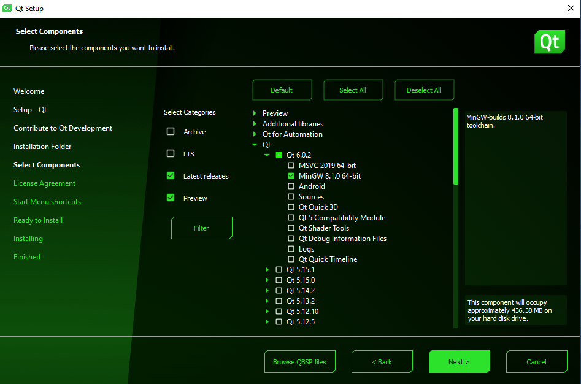
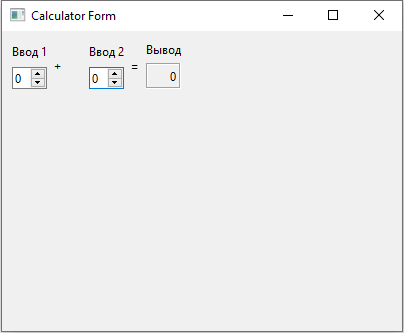

<p align="center">МИНИСТЕРСТВО НАУКИ  И ВЫСШЕГО ОБРАЗОВАНИЯ РОССИЙСКОЙ ФЕДЕРАЦИИ</p>

<p align="center">Федеральное государственное автономное образовательное учреждение высшего образования</p>

<p align="center">"КРЫМСКИЙ ФЕДЕРАЛЬНЫЙ УНИВЕРСИТЕТ им. В. И. ВЕРНАДСКОГО"</p>

<p align="center">ФИЗИКО-ТЕХНИЧЕСКИЙ ИНСТИТУТ</p>

<p align="center">Кафедра компьютерной инженерии и моделирования</p>

<br>

<h3 align="center">Отчёт по лабораторной работе № 4<br> по дисциплине "Программирование"</h3>

<br><br>

<p>студента 1 курса группы ПИ-б-о-201(1)<br>

Баламутин Егор Никитович<br>

направления подготовки 09.03.04 "Программная инженерия"</p>

<br><br>

<table>

<tr><td>Научный руководитель<br> старший преподаватель кафедры<br> компьютерной инженерии и моделирования</td>

<td>(оценка)</td>

<td>Чабанов В.В.</td>

</tr>

</table>

<br><br>

<p align="center">Симферополь, 2020</p>

<hr>

## Цель работы

1. Установить фреймворк Qt;
2. Изучить основные возможности создания и отладки программ в IDE Qt Creator.

## Постановка задачи

Настроить рабочее окружение, для разработки программного обеспечения при помощи Qt и IDE Qt Creator, а также 
изучить базовые возможности данного фреймворка.

## Выполнение работы

### Задание 1

Вначале я скачал с официального сайта и установил последнюю стабильную версию фреймворка Qt (Для этого потребовалось завести 
аккаунт Qt). Я запустил скачаный установщик, в котором  потребовалось войти в аккаунт, затем выбрать папку установки и 
компоненты для установки. Я выбрал ручную установку, затем выбрал нужные компоненты: компоненты для сборки MinGW 8.1.0 64-bit 
и соответствующую версию MinGW.


<p align="center">Рис 1. Установка Qt</p>

Чтобы убедиться, что установка прошла успешно, я запустил среду разработки Qt Creator и в разделе Примеры нашёл проект 
Calculator Form Example. Щёлкнув по проекту мне нужно было выбрать и настроить комплект сборки. Я выбрал версию под Desktop Qt 6.0.2 MinGW. 
Затем я открыл главную форму проекта и заменил в ней текст.


<p align="center">Рис 2. Скриншот приложения</p>

### Задание 2

1. *Как изменить цветовую схему (оформление) среды?*

Перейти: инструменты > параметры > среда. Затем выбрать нужные параметры.

2. *Как закомментировать/раскомментировать блок кода средствами Qt Creator? Имеется ввиду комбинация клавиш или пункт меню.*

Ctrl + /

3. *Как открыть в проводнике Windows папку с проектом средствами Qt Creator?*

В редакторе выбрать файл и нажать по нему ПКМ -> Открыть в проводнике

4. *Какое расширение файла-проекта используется Qt Creator? Может быть несколько ответов.*

Для сборщика Qt - .pro; для сборщика CMake - CMakeLists.txt

5. *Как запустить код без отладки?*

Слева внизу переставить режим с отладки на выпуск и нажать на зелёный треугольник.

6. *Как запустить код в режиме отладки?*

Слева внизу переставить режим на отладку и нажать на зелёный треугольник с жучком.

7. *Как установить/убрать точку останова (breakpoint)?*

Нажать слева от номера строки.

### Задание 3

Я создал консольное приложение без Qt. Затем вставил в `main.cpp` код:

```
#include <iostream>
 
int main() {
    int i;
    double d;
    i = 5;
    d = 5;
    std::cout << i << d;
}
```

Я установил точки останова на 6, 7 и 8 строку и запустил программу в режиме отладки. 
На строке 6 переменная `i` была равна 0, а `d` содержала мусорное значение. На строке 7 
переменная `i` стала равна 5, а `d` по прежнему содержала мусорное значение. На строке 8 
обе переменные были равны 5.

### Задание 4

Для того чтобы в репозиторий не попадали ненужные файлы нужно было настроить git для Qt. 
Я сгенерировал [шаблон для Qt Creator](https://www.toptal.com/developers/gitignore/api/qt,qtcreator) 
и добавил строки из него в файл .gitihgnore который уже был в данном репозитории.

## Вывод

По ходу выполнения лабораторной работы я установил среду разработки Qt Creator, ознакомился с элементами 
её интерфейса и базовым функцианалом