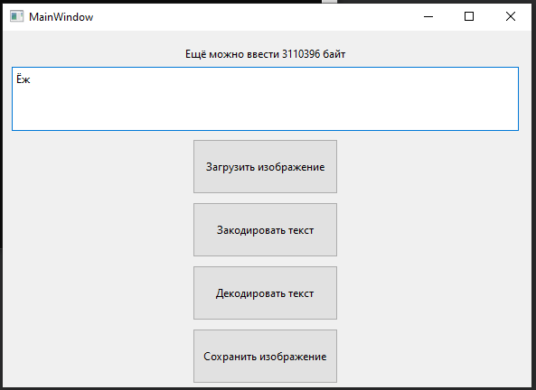

МИНИСТЕРСТВО НАУКИ  И ВЫСШЕГО ОБРАЗОВАНИЯ РОССИЙСКОЙ ФЕДЕРАЦИИ 
Федеральное государственное автономное образовательное учреждение высшего образования 
"КРЫМСКИЙ ФЕДЕРАЛЬНЫЙ УНИВЕРСИТЕТ им. В. И. ВЕРНАДСКОГО" 
ФИЗИКО-ТЕХНИЧЕСКИЙ ИНСТИТУТ 
Кафедра компьютерной инженерии и моделирования

 
<h3 align="center">Отчёт по лабораторной работе № 5  по дисциплине "Программирование"</h3>
  

студента 1 курса группы ПИ-б-о-201(1) 
Баламутин Егор Никитович 
направления подготовки 09.03.04 "Программная инженерия"

  
<table>
<tr><td>Научный руководитель  старший преподаватель кафедры  компьютерной инженерии и моделирования</td>
<td>(оценка)</td>
<td>Чабанов В.В.</td>
</tr>
</table>
  

Симферополь, 2021

## Цель
1. Изучить базовые встроенные элементы фреймворка Qt предназначенные для создания приложений с графическим интерфейсом пользователя (GUI);
2. Изучить сигнально-слотовую систему, как один из способов организации взаимодействия компонентов GUI;
3. Получить практический навык работы с побитовыми операторами.

## Постановка задачи

Создать десктоп приложение с GUI позволяющее сохранять текстовую информацию в изображение формата png без видимого изменения исходного изображения. Приложение должно позволять сохранять текст в картинку и извлекать текст из картинки.

## Выполнение работы

В начале в программе Qt Designer был создан простой графический интерфейс приложения (рис 1).

Рис 1. Интерфейс приложения

Далее файл интерфейса (mainwindow.ui) был подключен к проекту. Для каждой кнопки был создан соответствующий слот. Были реализованы следующие функции приложения:

1. Загрузка картинки в приложение
2. Декодирование сообщения
3. Кодирование введённого сообщения в картинку
4. Сохранение изображения

Также был создан ещё один слот для вывода на экран подсказки, сколько ещё информации поместится в изображение (видно на рис. 1).

Затем аналогичная программа была реализована на языке Python с использованием PySide6. Но был использован немного другой алгоритм кодирования, что позволило 
расшифровать сообщение в Картинке.

## Вывод
Удалось реализовать все требуемые функции приложения на [C++](C++) и на [Python](Python). Оно позволяет зашифровывать текст в картинку:

В картинке было зашифровано послание: Rick Astley обещал GTA VI